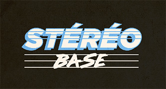

# generator-stereobase [![NPM version][npm-image]][npm-url]
> Generate a simple template

## Installation

First, install [Yeoman](http://yeoman.io) and generator-stereobase using [npm](https://www.npmjs.com/) (we assume you have pre-installed [node.js](https://nodejs.org/)).

```bash
npm install -g yo
npm install -g generator-stereobase
```

Then generate your new project:

```bash
yo stereobase
```

Then launch gulp for the first time

```bash
gulp start
```

And finally listen to file changes

```bash
gulp watch
```


## Publish the Generator | New version

```bash
npm set init.author.name "Your Name"
npm set init.author.email "Your Email"
npm set init.author.url "Your Website"
npm adduser
npm publish
```
https://docs.npmjs.com/cli/publish

## Change configstore files owner

```bash
sudo chown -R userMachine /Users/userMachine/.config/configstore/
```

## Browserify

http://putaindecode.io/fr/articles/js/browserify/

## Thanks

* Hugo Giraudel for [Sass Guidelines](https://sass-guidelin.es/)
* Chris Coyier for his book [Practical SVG](https://abookapart.com/products/practical-svg)
* [Loic Goyet](https://github.com/LoicGoyet) for the formation on Gulp and Yeoman.

## License

MIT © [Adrien Le Menthéour](www.adrienlm.com) | [Elisabeth Hamel](www.e-hamel.com)


[npm-image]: https://badge.fury.io/js/generator-stereobase.svg
[npm-url]: https://npmjs.org/package/generator-stereobase
[travis-image]: https://travis-ci.org/stereosuper/generator-stereobase.svg?branch=master
[travis-url]: https://travis-ci.org/stereosuper/generator-stereobase
[daviddm-image]: https://david-dm.org/stereosuper/generator-stereobase.svg?theme=shields.io
[daviddm-url]: https://david-dm.org/stereosuper/generator-stereobase
